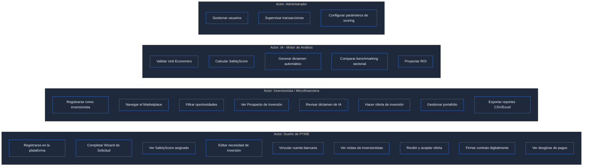

# SafetyScore — Casos de Uso: Vista General del Sistema

## UC-00: Diagrama General del Ecosistema

```mermaid
graph TB
    subgraph Actores
        PYME[("👤 Dueño de PYME\n(Comerciante)")]
        INV[("🏦 Inversionista /\nMicrofinanciera")]
        IA[("🤖 IA de SafetyScore\n(Claude 3.5 Sonnet)")]
        ADMIN[("⚙️ Administrador\nde Plataforma")]
    end

    subgraph SafetyScore["🔐 Plataforma SafetyScore"]
        MARKET[Marketplace de\nOportunidades]
        SCORE[Motor de\nSafetyScore]
        PROSP[Generador de\nProspectos]
        PORTAL_PYME[Portal PYME\nDashboard]
        PORTAL_INV[Portal Inversionista]
        AUTH[Autenticación\nSupabase]
    end

    subgraph Externos["🌐 Servicios Externos"]
        NESSIE[API Nessie\n(Simulación Bancaria)]
        STRIPE[Stripe / Open Banking\n(Dispersión Fondos)]
    end

    PYME -->|Registra negocio y\nnecesidad de capital| PORTAL_PYME
    PORTAL_PYME --> SCORE
    SCORE --> IA
    IA -->|Genera dictamen| PROSP
    PROSP --> MARKET
    INV -->|Navega y filtra| PORTAL_INV
    PORTAL_INV --> MARKET
    INV -->|Hace oferta de inversión| MARKET
    MARKET -->|Notifica match| PYME
    NESSIE -->|Simula flujo de caja| SCORE
    STRIPE -.->|Dispersión de fondos\n(proyectado)| PYME
    ADMIN --> AUTH
```

---

## UC-01: Visión General de Casos de Uso por Actor


