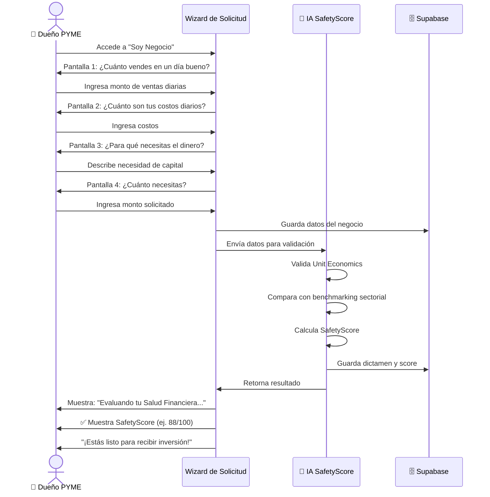
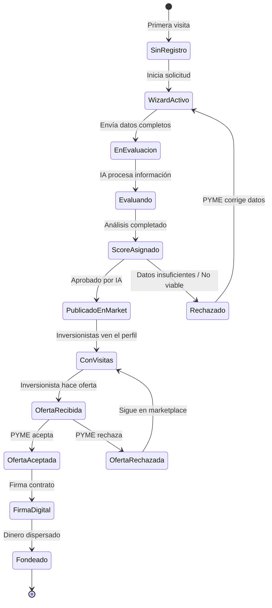
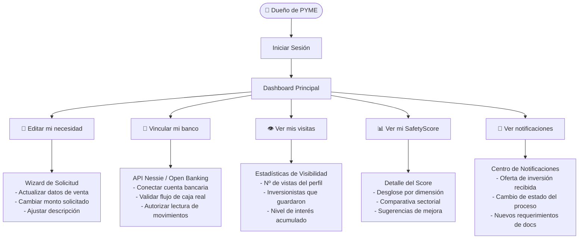

# SafetyScore — Casos de Uso: Flujos del Dueño de PYME

## UC-P01: Registro y Onboarding de la PYME (Wizard)



---

## UC-P02: Dashboard Principal de la PYME



---

## UC-P03: Acciones Rápidas del Dashboard PYME

```mermaid
usecase
```



---

## UC-P04: Aceptación de Oferta y Firma Digital

```mermaid
flowchart TD
    START([🔔 Notificación: Nueva oferta recibida]) --> VIEW[PYME ve pantalla "¡Hicimos Match!"]
    VIEW --> DETAILS[Ver resumen:\n- Nombre del inversionista\n- Monto ofrecido\n- Plazo de pago\n- Tasa acordada]

    DETAILS --> REVIEW{¿Quiere revisar más?}
    REVIEW -->|Sí| BREAKDOWN[Ver desglose de pagos\n- Tabla de amortización\n- Calendario de pagos\n- Condiciones]
    BREAKDOWN --> DECISION{¿Acepta la oferta?}
    REVIEW -->|No, decide| DECISION

    DECISION -->|✅ Acepta| SIGN[Aceptar y firmar digitalmente]
    DECISION -->|❌ Rechaza| REJECT[Rechazar oferta]

    SIGN --> CONFIRM[Confirmar identidad\n- OTP / Biometría]
    CONFIRM --> CONTRACT[Contrato generado\nautomáticamente]
    CONTRACT --> DISPERSAL[Dispersión de fondos\nvía Stripe / Open Banking]
    DISPERSAL --> SUCCESS[✅ Capital recibido\nDashboard actualizado]

    REJECT --> BACK[Regresa al Marketplace\nEl perfil sigue activo]
```
