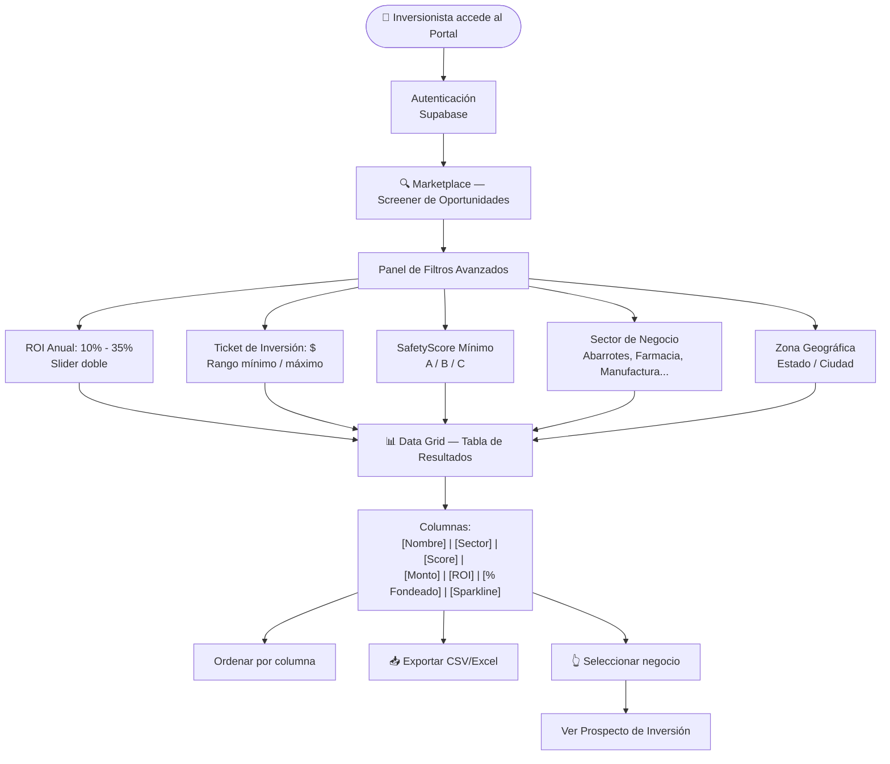
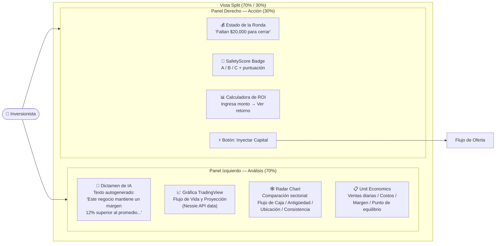
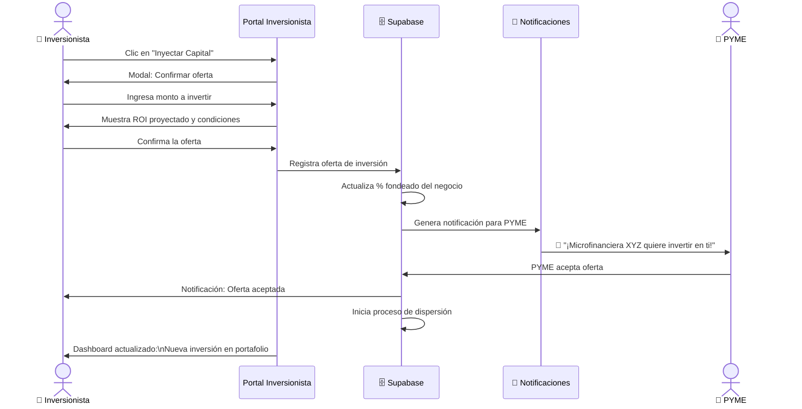
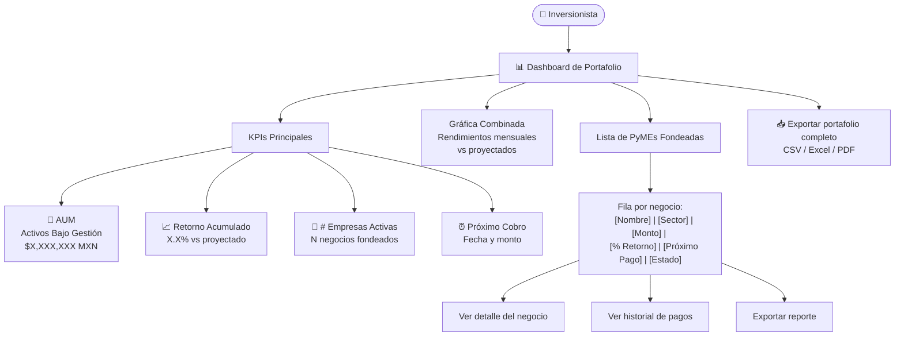
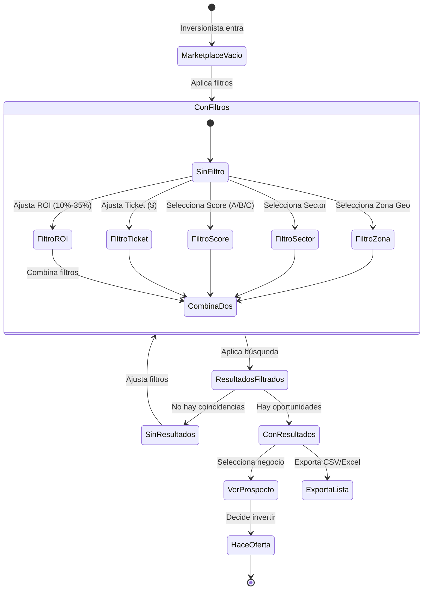

# SafetyScore — Casos de Uso: Flujos del Inversionista / Microfinanciera

## UC-I01: Navegación del Marketplace (Screener)

---

## UC-I02: Revisión del Prospecto de Inversión (Vista Detallada)

---

## UC-I03: Proceso de Realización de Oferta

---

## UC-I04: Gestión del Portafolio de Inversiones

---

## UC-I05: Sistema de Filtros y Búsqueda Avanzada

