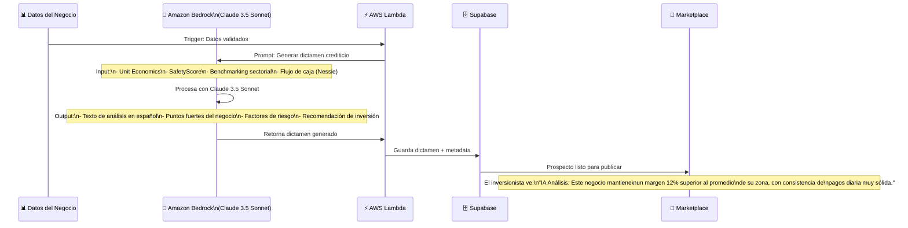
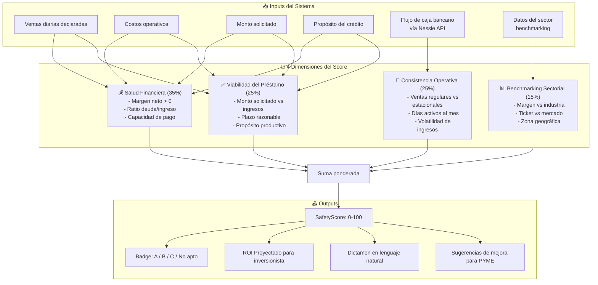
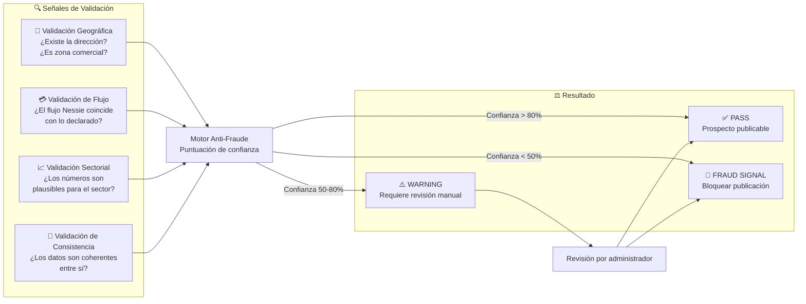

# SafetyScore — Casos de Uso: Motor de IA y SafetyScore

## UC-AI01: Flujo Completo del Motor de Análisis IA

```mermaid
flowchart TD
    INPUT([📥 Datos del Wizard PYME]) --> VALIDATE{Validar completitud\nde datos}
    VALIDATE -->|Incompletos| REJECT1[❌ Solicita datos faltantes\nal usuario]
    VALIDATE -->|Completos| ECONOMICS[Calcular Unit Economics]

    ECONOMICS --> E1[Margen bruto diario\nVentas - Costos]
    ECONOMICS --> E2[Punto de equilibrio\n¿Cuántos días para pagar?]
    ECONOMICS --> E3[Ratio de viabilidad\n¿Puede asumir el préstamo?]

    E1 & E2 & E3 --> BENCH[Benchmarking Sectorial]
    BENCH --> B1[Comparar margen vs\npromedio del sector]
    BENCH --> B2[Comparar monto vs\ntickets típicos del sector]
    BENCH --> B3[Validar consistencia\ncon zona geográfica]

    B1 & B2 & B3 --> NESSIE[🏦 Consultar API Nessie\nFlujo de caja simulado]
    NESSIE --> CASHFLOW[Análisis de flujo:\n- Consistencia de depósitos\n- Volatilidad de saldo\n- Tendencia 3 meses]

    CASHFLOW --> SCORE_CALC[🧮 Cálculo del SafetyScore]
    SCORE_CALC --> S1["Dimensión 1: Salud Financiera (35%)"]
    SCORE_CALC --> S2["Dimensión 2: Consistencia Operativa (25%)"]
    SCORE_CALC --> S3["Dimensión 3: Viabilidad del Préstamo (25%)"]
    SCORE_CALC --> S4["Dimensión 4: Benchmarking Sectorial (15%)"]

    S1 & S2 & S3 & S4 --> FINAL_SCORE[SafetyScore Final\n0 - 100 pts]

    FINAL_SCORE --> BADGE{Asignar Badge}
    BADGE -->|80-100| GRADE_A[🟢 Grado A\nBajo Riesgo]
    BADGE -->|60-79| GRADE_B[🟡 Grado B\nRiesgo Medio]
    BADGE -->|40-59| GRADE_C[🟠 Grado C\nRiesgo Alto]
    BADGE -->|< 40| GRADE_D[🔴 No apto\nNo publicar]

    GRADE_A & GRADE_B & GRADE_C --> DICTAMEN[📝 Generar Dictamen IA\n(Texto en lenguaje natural)]
    GRADE_A & GRADE_B & GRADE_C --> ROI_PROJ[📊 Proyectar ROI\npara el inversionista]

    DICTAMEN & ROI_PROJ --> PUBLISH[✅ Publicar en Marketplace]
    GRADE_D --> FEEDBACK[💬 Retroalimentación al PYME\nQué mejorar para re-aplicar]
```

---

## UC-AI02: Generación del Dictamen Automático



---

## UC-AI03: Motor de Cálculo del SafetyScore (Detalle)



---

## UC-AI04: Validación Anti-Fraude (Proof of Business)


