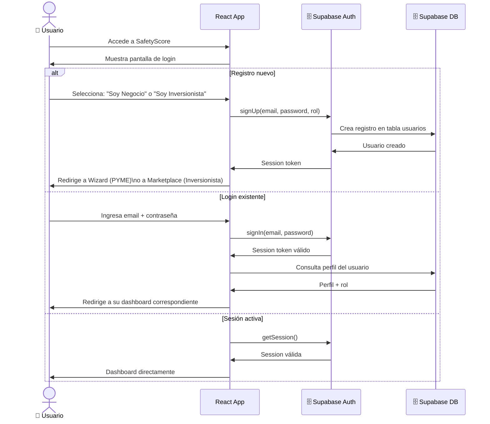
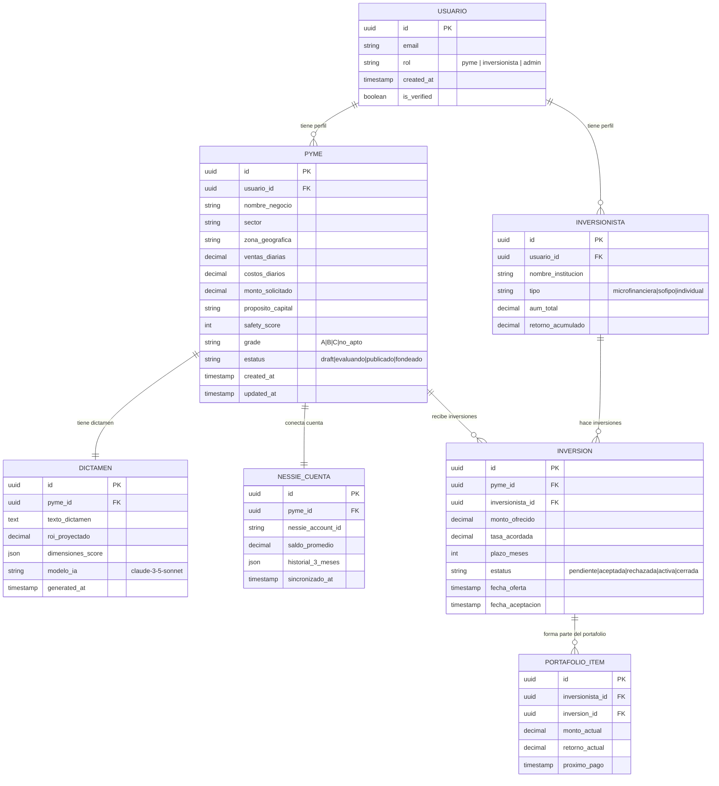
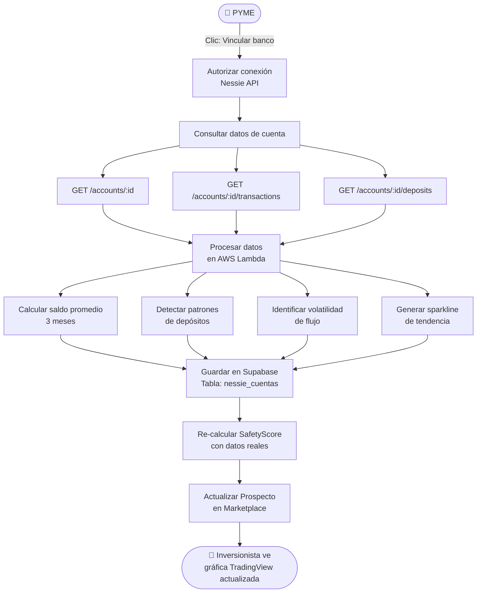
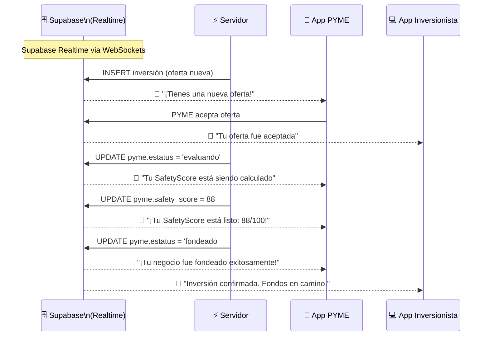

# SafetyScore — Casos de Uso: Autenticación y Flujos de Datos

## UC-D01: Flujo de Autenticación (Supabase)

---

## UC-D02: Arquitectura de Datos — Entidades Principales

---

## UC-D03: Integración con API Nessie (Simulación Bancaria)

---

## UC-D04: Flujo de Notificaciones en Tiempo Real

