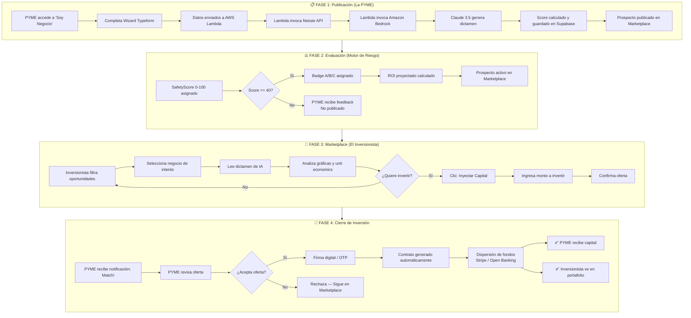
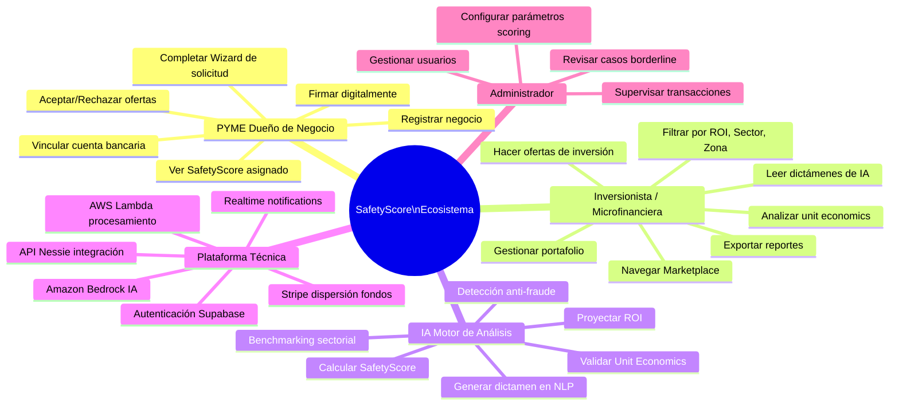
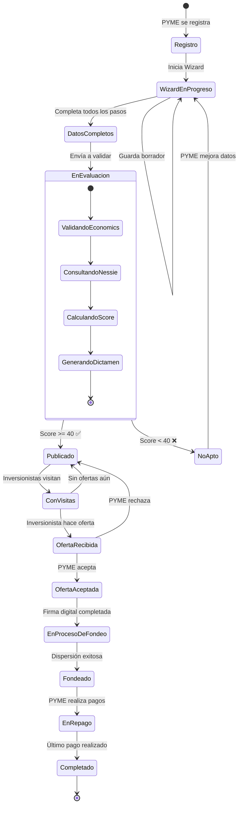

# SafetyScore — Caso de Uso End-to-End: Viaje Completo del Ecosistema

## UC-E2E01: Journada Completa del Sistema (Happy Path)

```mermaid
journey
    title SafetyScore — Viaje del Usuario (Happy Path)
    section PYME: Solicita Capital
      Ingresa datos de ventas: 5: PYME
      Completa el Wizard: 4: PYME
      Espera evaluación de IA: 3: PYME, Sistema
      Recibe SafetyScore 88/100: 5: PYME, IA
      Su negocio aparece en Marketplace: 5: PYME
    section Inversionista: Descubre Oportunidad
      Filtra por ROI > 15% en Abarrotes: 5: Inversionista
      Ve el perfil de la PYME: 4: Inversionista
      Lee dictamen de IA: 5: Inversionista
      Analiza gráfica TradingView: 4: Inversionista
      Hace oferta de $200,000 MXN: 5: Inversionista
    section Cierre: Inversión Exitosa
      PYME recibe notificación de oferta: 5: PYME, Sistema
      PYME acepta y firma digitalmente: 5: PYME
      Fondos son dispersados: 5: PYME, Inversionista
      Inversionista ve inversión en portafolio: 5: Inversionista
```

---

## UC-E2E02: Flujo Completo del Sistema (Técnico)



---

## UC-E2E03: Mapa de Actores y Responsabilidades



---

## UC-E2E04: Ciclo de Vida de un Negocio en SafetyScore


